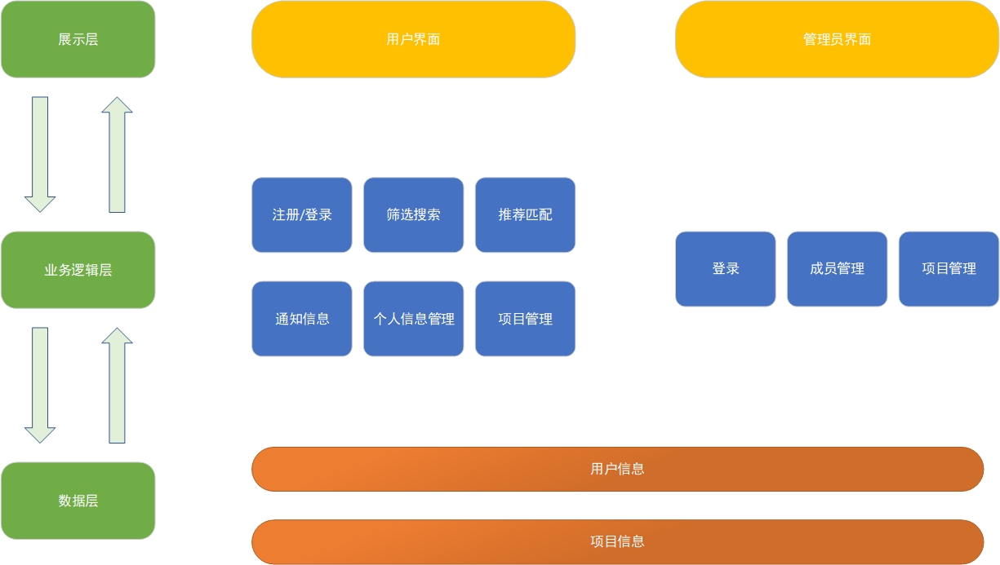
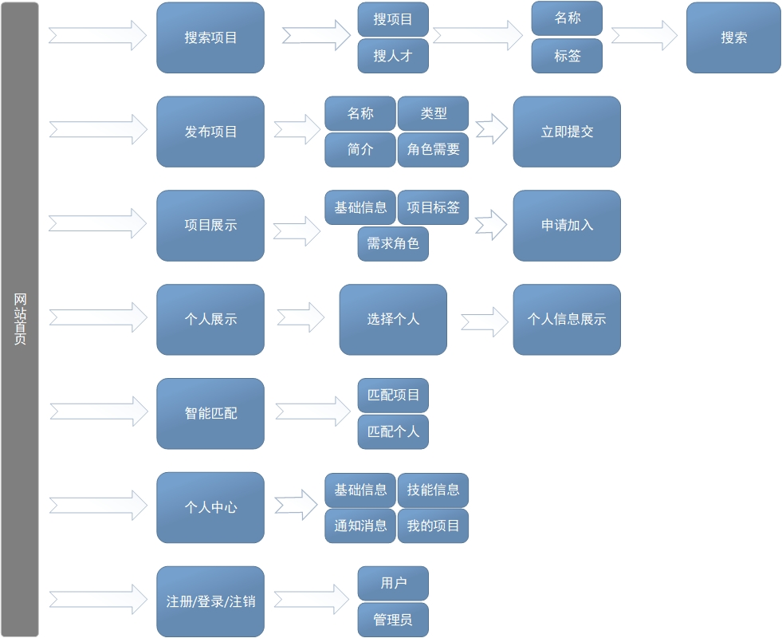
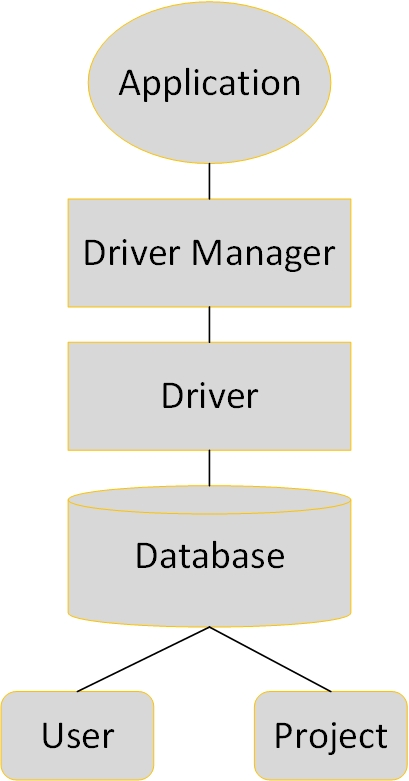

一、总述

1.1 编写目的

本架构报告从层次架构、集成架构和数据架构三个角度，通过图示来详细说明本项目的架构设计，为软件编程和系统测试与维护提供支持。

1.2 预期读者

本文档的预期读者为系统设计人员、软件开发人员、软件测试人员和项目评审人员。

二、层次架构

2.1 内容概述

我们选用Web应用的三层架构，将Web应用中的组件划分为以下三个层次：展示层（封装和用户或者其他系统交互）、业务逻辑层（组成业务逻辑）和数据层（封装持久存储）。区分层次的目的即为了“高内聚，低耦合”的思想。开发人员可以只关注整个结构中的其中某一层；可以很容易的用新的实现来替换原有层次的实现；可以降低层与层之间的依赖；有利于标准化；利于各层逻辑的复用。

2.2 模型详情

三、集成架构

3.1 内容概述

集成架构展示了Web应用和外部系统或内部系统的集成，包括展示层面、应用逻辑层面和内容层面。我们选用Portal架构，该架构以用户为中心，提供统一的用户登录，实现信息的集中访问，集成了一体化的工作流环境。利用Portal架构，可以方便地将用户所需要的，来源于各种渠道的信息资料集成在一个统一的桌面视窗之内。根据Portal提供的定制功能，可以为不同人员定制特有的信息门户，将用户共同所需信息有效地组织在统一的Web浏览器之中，并可根据用户类别来设定相应的访问操作权限。

3.2 模型详情

四、面向数据的架构

4.1 内容概述

本项目以采用以数据为中心的架构，采用结构化数据(JDBC/ODBC)，通过Web扩展和应用服务器进行访问。该架构十分成熟且易于实现。

4.2 模型详情

