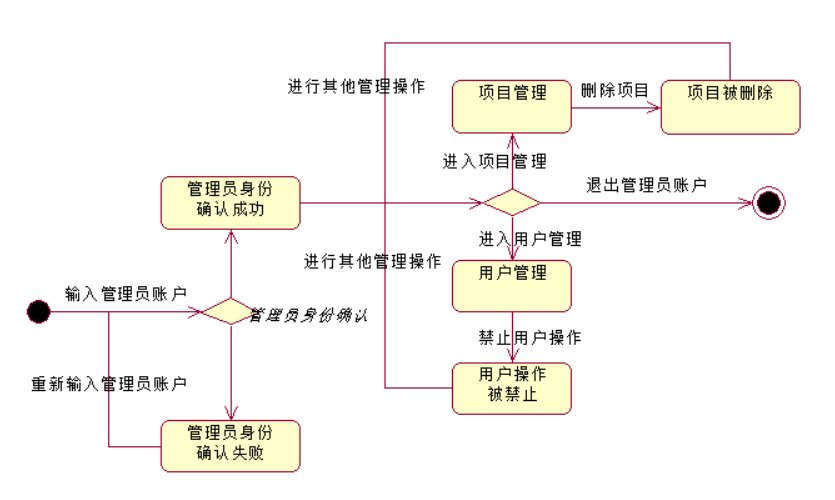

内容设计：

一、 提供用户注册/登录、项目列表、人才库、项目介绍/需求、个人主页等可用内容组件及其组成和包含发布、项目、人才等页面切换按钮的导航栏，为用户提供清晰的内容视图。

二 、 目标

1. 把以一组详细内容对象表示的内容需求转化为web应用具体的信息设计。

由于我们的项目属于小型的web应用，我们采用了自底向上的信息设计方法，根据对我们项目的内容和功能需求的分析，需求主要分为项目发布者的对人才信息的 ，以及人才信息发布者对感兴趣的项目详情的需求。依照自底向上的设计，我们仅从实际的项目详情、个人信息详情等基础web页面的设计和构建开始，再逐步把这些web页面链接起来。

1. 如何组织、访问和管理这些内容。

​        为了更好的帮助用户在网络和web环境中成功的发现和管理信息，有效的解决用户的信息需求，我们采用从下到上的架构方法进行了信息架构设计。从下到上的架构方法是根据内容和功能需求的分析而来的，先把已有的所有内容，放在最低层级分类中，再将他们分别归类到较高一级的类别。在我们的项目中，项目信息和人才信息是最低级的分类，把他们归属到上一级的类别——项目列表和人才库。

​        为了给用户提供良好的访问体验；使用户在任何给定的时间知道哪些导航选项可用；给用户说明当前所在以及正在看什么；允许用户在信息结构内游走，我们的项目提供了以下访问机制：对导航选项在不可用并被点击时，弹出错误信息；在各级界面的第一栏处显示了当前访问的内容标题，例如：项目、人才、登录、注册等；在同一级的界面直接提供相互转换的导航按钮，例如人才的个人主页，提供“下一个”的查看导航。

​        秉承着明确标记、全局链接、快捷方式、层级和轨迹、个性化、搜索机制等原则，我们的项目设计了全局导航（主页、发布、项目、人才、智能匹配、学习平台、登录、注册），提供了快速发布信息或是页面跳转的快捷方式。而项目列表和人才库的略缩形式可看为是一个局部导航，到具体详情页的局部导航。

1. 定义所有内容的布局、结构和作为web应用的一部分进行展示的内容大纲。

   a) 主结构：人才库——人才——人才主页、项目列表——项目——项目详情为信息从宽泛到具体的层次结构。

   b) 项目的参与为线性结构：先搜索项目——浏览项目——选择项目——提交参与申请——等待审核——确定加入——评价项目。

   c) 人才的邀请为线性结构：先搜索人才——浏览相关子人才库——选择人才——发起项目邀请——等待通过——确定参与——评价人才。

   d) 搜索功能为矩阵结构。项目的搜索可从项目类型、项目需求的人才类型等不同的方向来浏览。人才的搜索可从人才的职能、人才的个人标签等来浏览。

功能设计：

一、 用户个人中心：

1. 注册、登录、退出登录

   

2. 修改个人资料，包括基础信息和技能信息

   

3. 通知信息的处理（处理用户间组队请求）

   

4. 管理自己项目

   

二、 首页信息：

1. 项目列表

2. 个人列表

3. 项目详情（申请加入），个人详情（邀请加入），触发邮件提醒

   申请加入项目：

   

邀请成员加入：

1. 筛选和搜索功能

   

2. 发布项目功能

   

3. 推荐匹配功能（暂定）

三、 后台管理：

1. 管理员登录、管理

2. 项目列表、个人列表、对两者的删除、禁用操作

   